To get started, you need to connect your wallet to Quill.

   

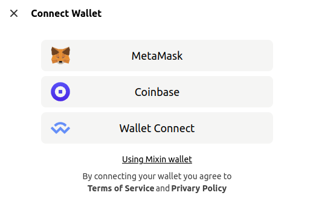

   

## MetaMask

Ensure to install the [MetaMask Extension](https://metamask.io/download/) for your browser. Chrome, Firefox, Brave and Edge are supported. And if you're using Brave, the built-in Brave Wallet is ready to use.

Click _Connect Wallet_ in [Quill](https://quill.im) navbar. Select _MetaMask_ in the popup modal.

It'll invoke the MetaMask extension to finish the connect process. Once connected, click _MetaMask_ button again, it'll popup a **Signature Request**.

Click **Sign** button and there you go.

   

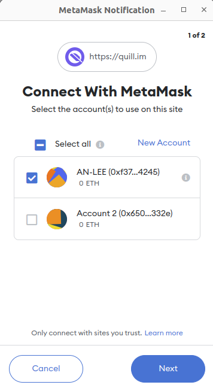

   

   

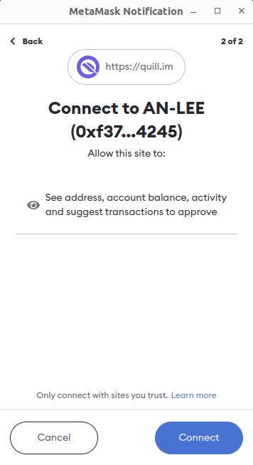

   

   

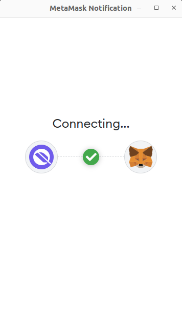

   

   

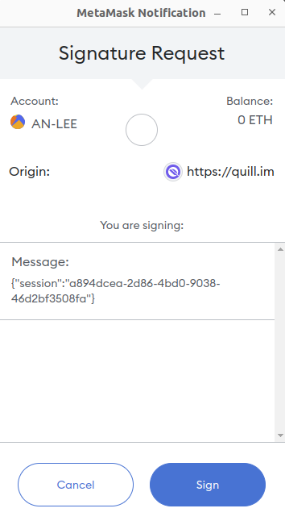

   

If you prefer [MetaMask App](https://metamask.io/download/), you may choose _Wallet Connect_ in the popup. And then scan the qrcode using [MetaMask App](https://metamask.io/download/).

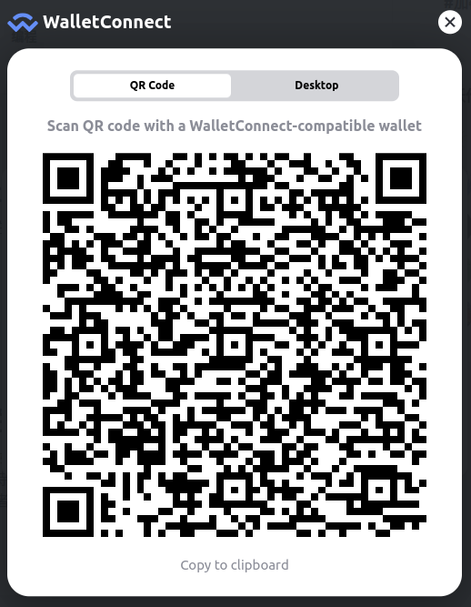

   

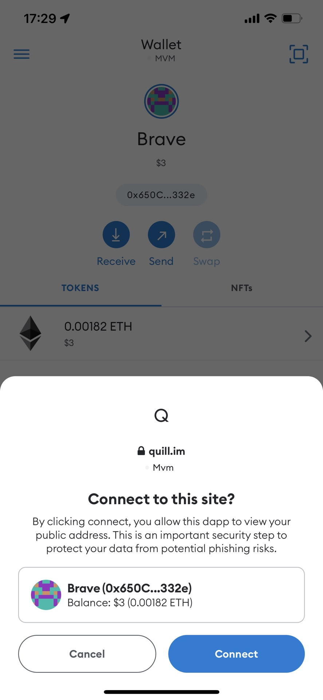

   

   

   

## Coinbase

Choose _Coinbase_ in the popup modal.

Scan the qrcode in [coinbase wallet app](https://www.coinbase.com/wallet). And sign the signature.

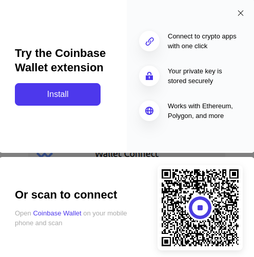

   

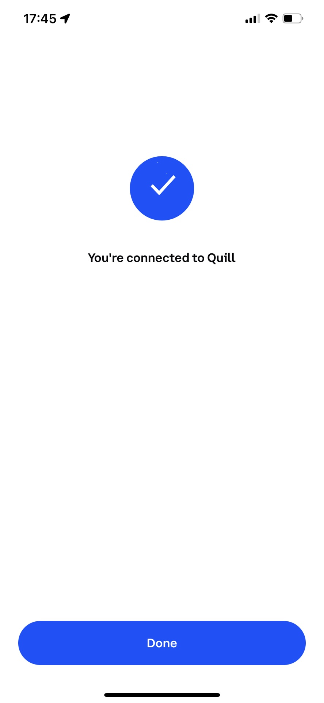

   

   

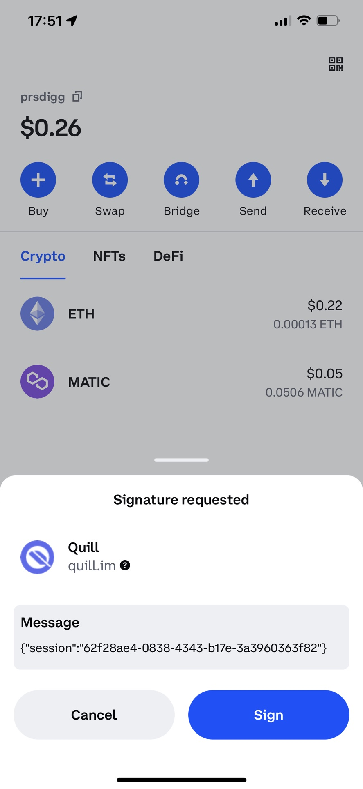

   

## imToken

Choose _Wallet Connect_ in the popup modal. Scan the qrcode in [imToken App](https://token.im/download).

Then allow to connect and sign the signature.

   

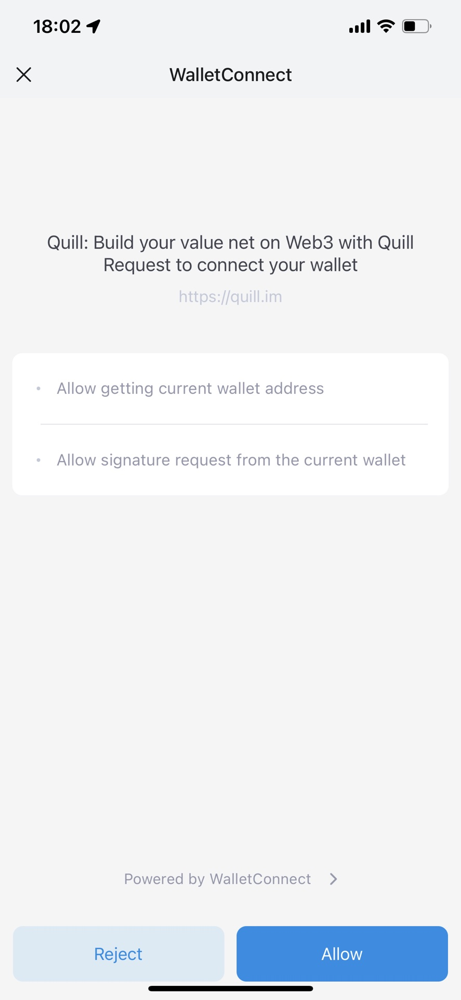

   

   

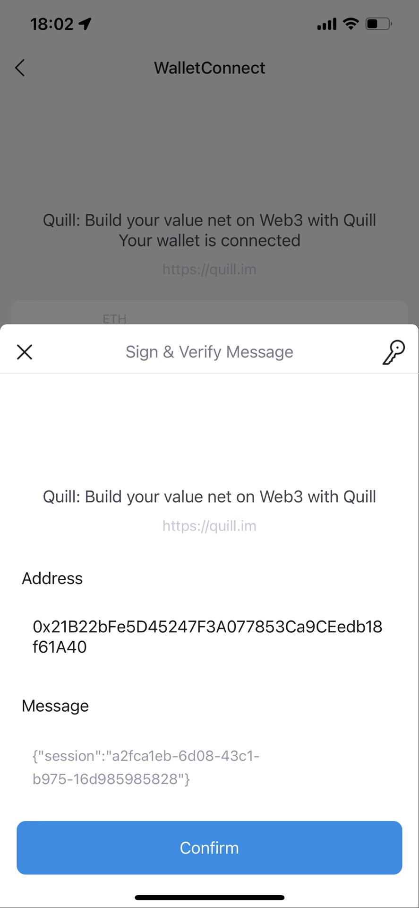

   

