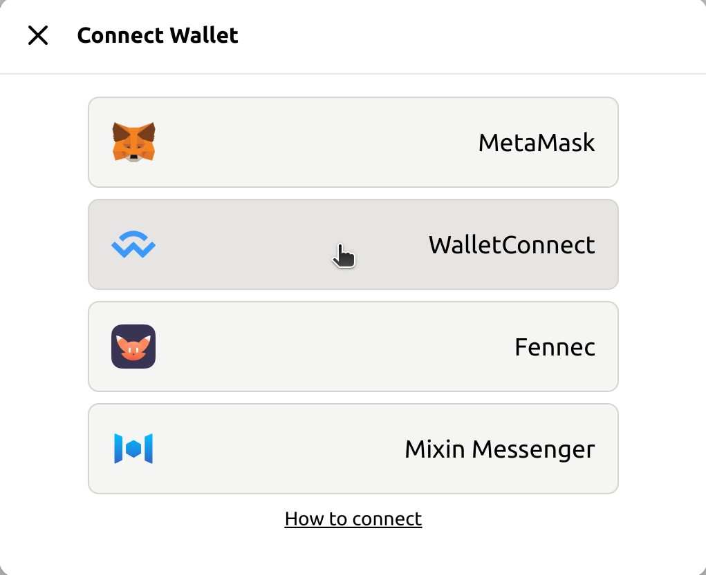
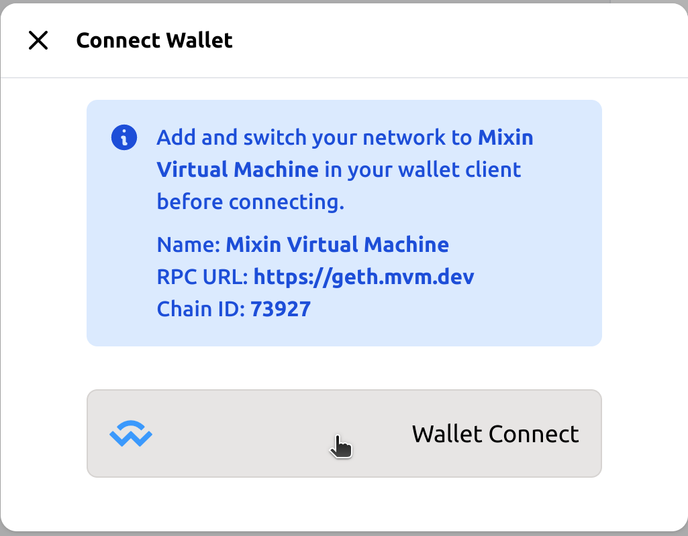
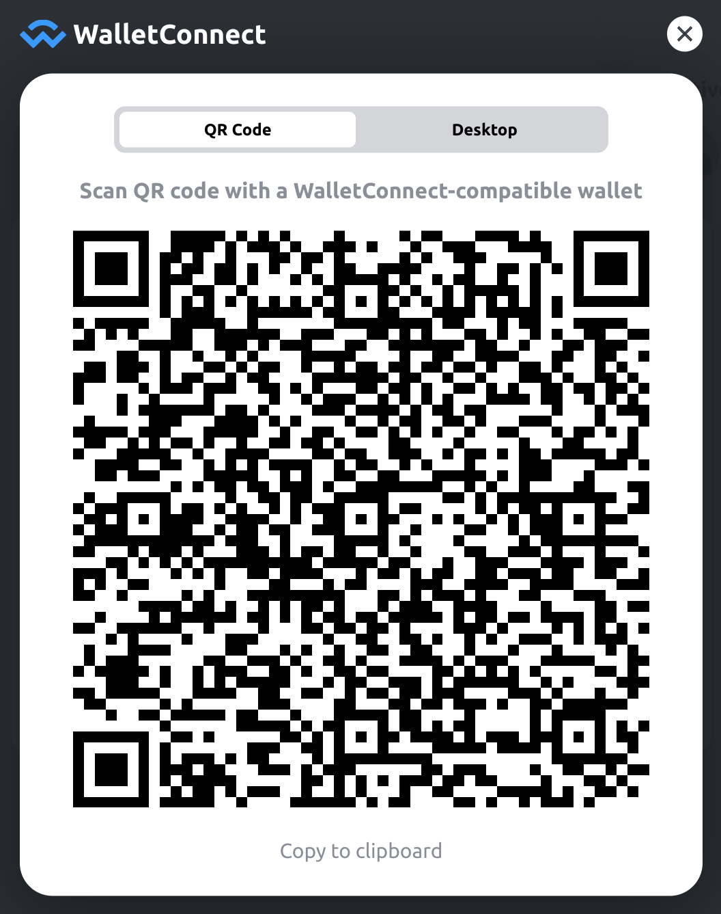
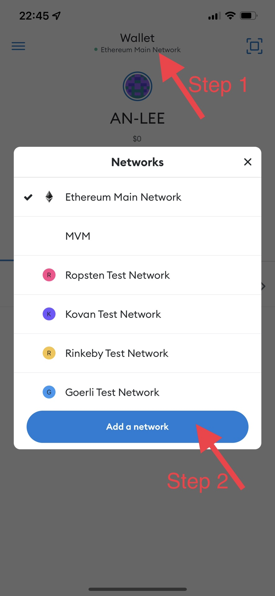
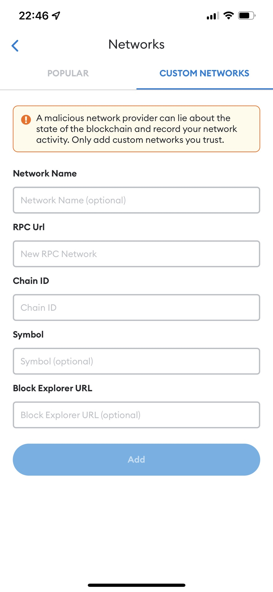
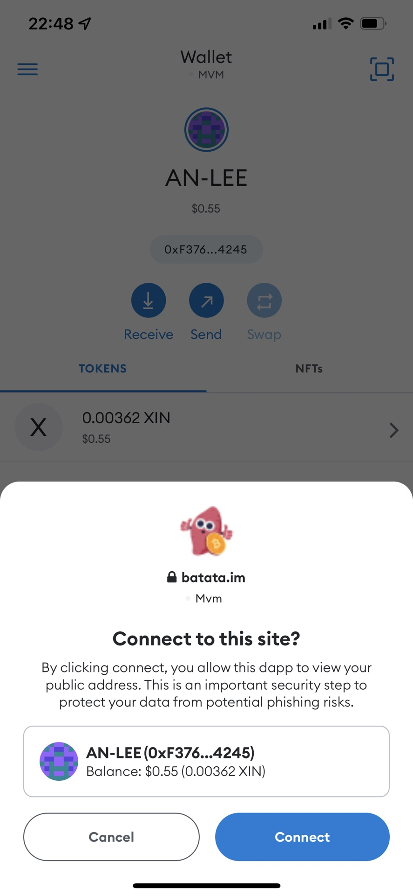
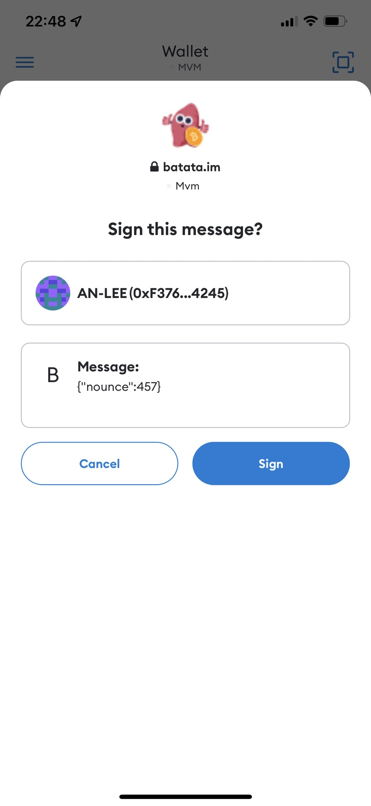

# With MetaMask App

## Install MetaMask App

Ensure to install the [MetaMask App](https://metamask.io/download/) on your phone.

## Invoke to connect

Click _Connect Wallet_ in [Batata](https://batata.im) navbar. Select _WalletConnect_ in the popup modal.

## Add MVM network

Before connecting, you should add and switch network to [Mixin Virtual Machine(MVM)](https://scan.mvm.dev) on the MetaMask App.

Open MetaMask App on your phone. Tap the network button on top to add a network.

Fill the custom network form with the information following.

> Name: MVM
>
> RPC URL: https://geth.mvm.dev
>
> Chain ID: 73927
>
> Symbol: XIN
>
> Block Explorer URL
>
> https://scan.mvm.dev

## Scan to connect

Scan the WalletConnect Qrcode using MetaMask App. It will popup some modals to confirm.

Confirm to connect and sign to authorize.

🥳🥳🥳 Hooray! You're ready to use [Batata](https://batata.im) now!
