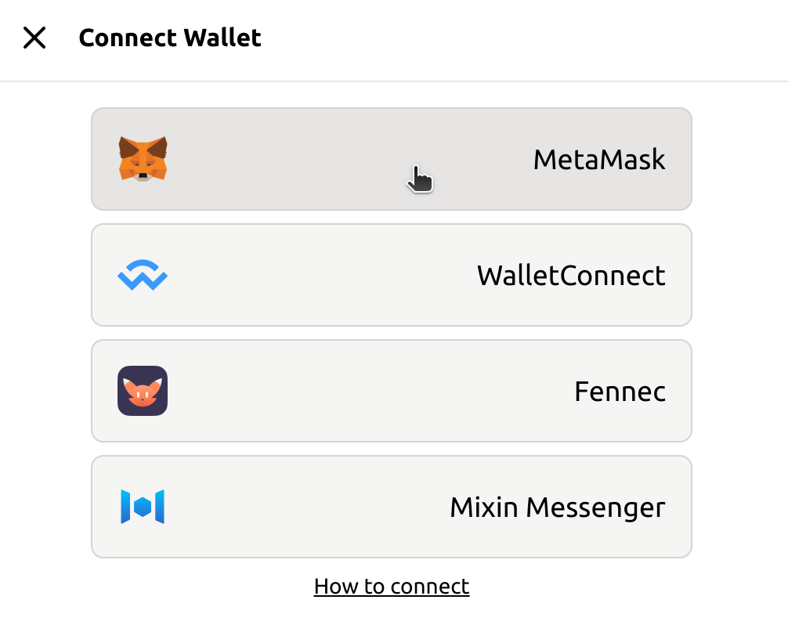
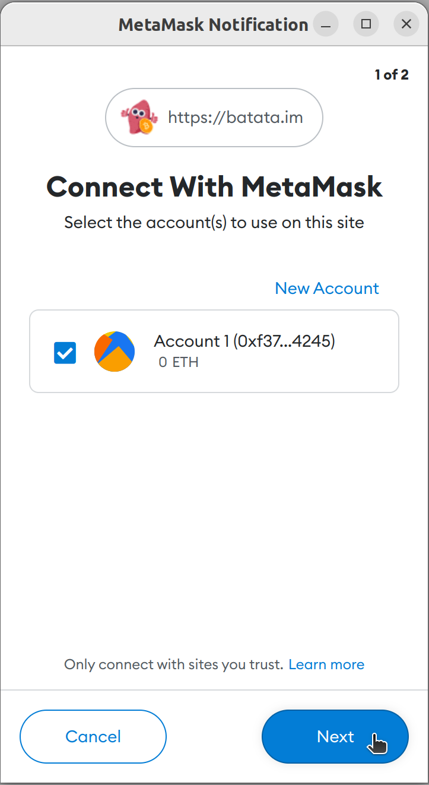
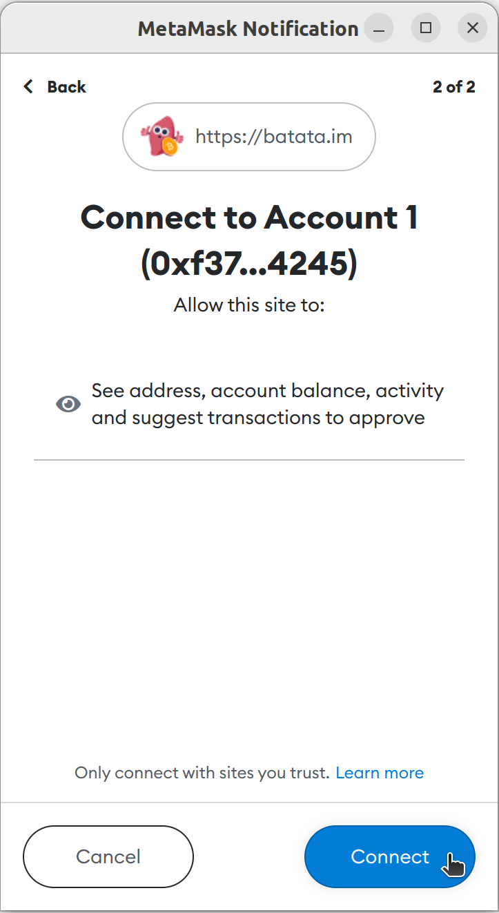
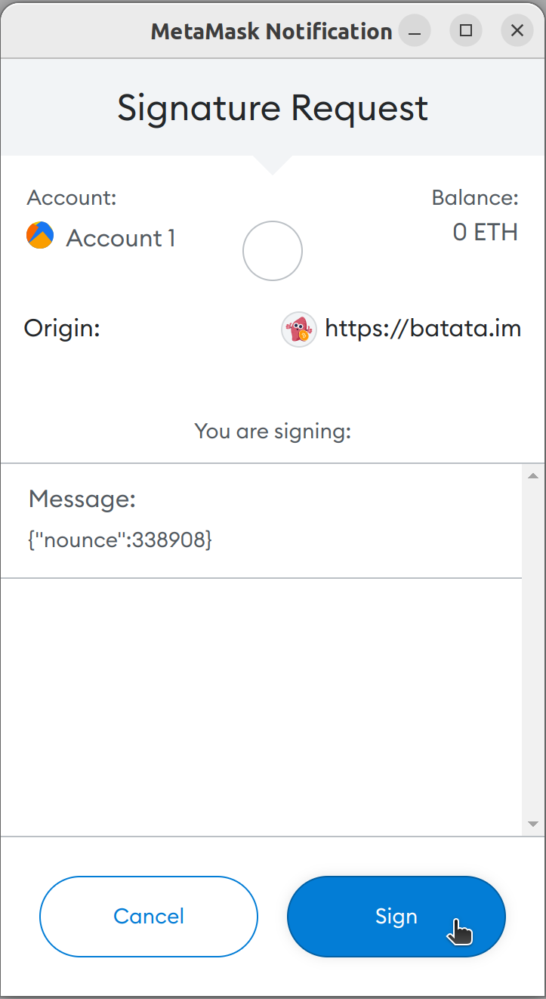
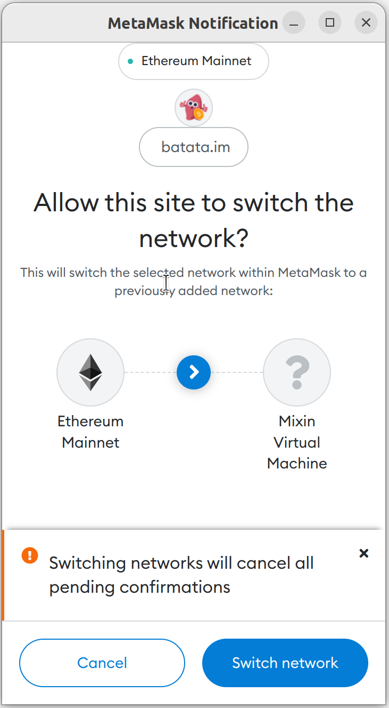

# With MetaMask Extension

## Install MetaMask Extension

Ensure to install the [MetaMask Extension](https://metamask.io/download/) for your browser. Chrome, Firefox, Brave and Edge are supported.

And if you're using Brave, the built-in Brave Wallet is ready to use.

## Invoke to connect

Click _Connect Wallet_ in [Quill](https://quill.im) navbar. Select _MetaMask_ in the popup modal.

## Select your account

Unlock your MetaMask first if it is locked. Select your account to connect [Quill](https://quill.im).

## Sign to authorize

Then, [Quill](https://quill.im) will invoke a signature request for MetaMask to authorize.

Click _Sign_. Then you're connected now!

## Switch to MVM

If you're using [Quill](https://quill.im) for the first time. It may request you to change network to [Mixin Virtual Machine(MVM)](https://scan.mvm.dev). Confirm to switch.

🥳🥳🥳 Hooray! You're ready to use [Quill](https://quill.im) now!
